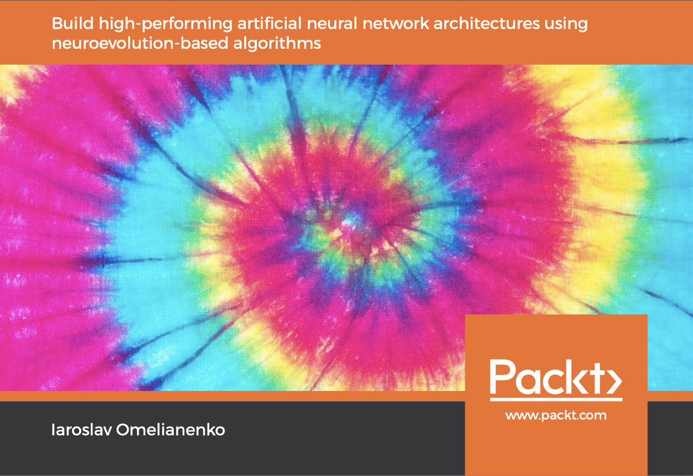
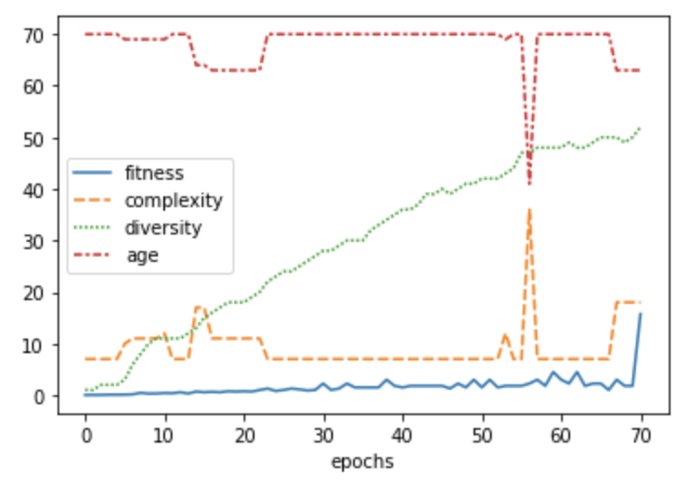
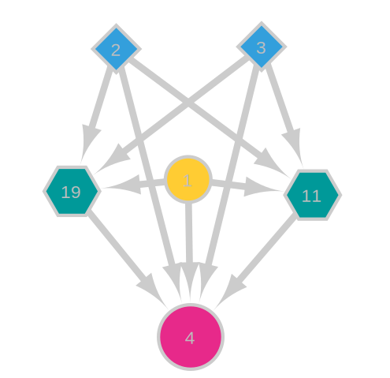

# goNEAT
[][6]

[NeuroEvolution — evolving Artificial Neural Networks topology from the scratch](https://becominghuman.ai/neuroevolution-evolving-artificial-neural-networks-topology-from-the-scratch-d1ebc5540d84)

[](https://github.com/yaricom/goNEAT/releases/latest)
[](https://travis-ci.org/yaricom/goNEAT) [](https://godoc.org/github.com/yaricom/goNEAT/neat)
[](https://github.com/moovweb/gvm)
[](https://github.com/yaricom/goNEAT/blob/master/LICENSE)
[](https://github.com/yaricom/goNEAT)
[](https://sourcegraph.com/github.com/yaricom/goNEAT?badge)

| Branch | Tests                                                                                      | Coverage                                                                                                                             | Linting                                                                    | Code Security                                                                    |
|--------|--------------------------------------------------------------------------------------------|--------------------------------------------------------------------------------------------------------------------------------------|----------------------------------------------------------------------------|----------------------------------------------------------------------------|
| master | [](https://github.com/yaricom/goNEAT/actions/workflows/ci.yml) | [](https://codecov.io/gh/yaricom/goNEAT) | [](https://github.com/yaricom/goNEAT/actions/workflows/lint.yml) | [](https://github.com/yaricom/goNEAT/actions/workflows/codeql-analysis.yml) |

## Overview
This repository provides implementation of [NeuroEvolution of Augmenting Topologies (NEAT)][1] method written in Go language.

The NeuroEvolution (NE) is an artificial evolution of Neural Networks (NN) using genetic algorithms to find optimal NN 
parameters and network topology. NeuroEvolution of NN may assume a search for optimal weights of connections between NN 
nodes and search for the optimal topology of the resulting network graph. The NEAT method implemented in this work 
searches for optimal connection weights and the network graph topology for a given task (number of NN nodes per layer 
and their interconnections).

## Minimum requirements
| Requirement | Notes            |
|-------------|------------------|
| Go version  | Go1.15 or higher |

## Releases

Please do not depend on master as your production branch. Use [releases](https://github.com/yaricom/goNEAT/releases) instead.

## Quick Start

You can evaluate the NEAT algorithm performance by running the following command:

```bash
cd $GOPATH/src/github.com/yaricom/goNEAT
go run executor.go -out ./out/xor -context ./data/xor.neat -genome ./data/xorstartgenes -experiment XOR
```

Or

```bash
make run-xor
````

The command above will run the [XOR problem solver experiment](https://github.com/yaricom/goNEAT/wiki/XOR-Experiment#the-xor-experiment-with-connected-inputs-in-the-start-genome)
and save the collected data samples. You can use saved experimental data for analysis using standard plotting
libraries as in the figure below.



The figure was created using Matplotlib. You can find more details in the [Jupyter notebook](contents/notebooks/experiments_results.ipynb).

## Documentation

You can find the algorithm performance evaluation and related documentation in the project's [wiki](https://github.com/yaricom/goNEAT/wiki)

The goNEAT library saves results of the experiments using [Numpy NPZ](https://numpy.org/doc/stable/reference/generated/numpy.savez.html)
format, which allows analysis of collected experimental
data samples using a variety of readily available Python libraries.

For your reference, we included [Jupyter notebook](contents/notebooks/experiments_results.ipynb) with an 
example of the collected experimental data analysis, which can be used as a starter kit to analyze data 
samples acquired from your experiments.

### Installation

Make sure you have at least GO 1.15.x installed onto your system and execute the following command:
```bash

go get github.com/yaricom/goNEAT
```

For new projects, consider using the v2 of the library with the following import:

```go
import "github.com/yaricom/goNEAT/v2"
```

## Essential Packages

### [`genetics`](https://pkg.go.dev/github.com/yaricom/goNEAT/v2/neat/genetics "API documentation") package

The `genetics` package provides the genetic part of the NEAT algorithm describing all the machinery related to
genome mutations, mating, and speciation of the population of organisms.

It contains implementation of all important types related to the NEAT algorithm:
* [`Gene`](https://pkg.go.dev/github.com/yaricom/goNEAT/v2/neat/genetics#Gene) type in this system specifies a "Connection Gene."
* [`MIMOControlGene`](https://pkg.go.dev/github.com/yaricom/goNEAT/v2/neat/genetics#MIMOControlGene) type is the Multiple-Input Multiple-Output (MIMO) control Gene which allows creation of modular genomes  
* [`Genome`](https://pkg.go.dev/github.com/yaricom/goNEAT/v2/neat/genetics#Genome) type is the primary source of genotype information used to create a phenotype.
* [`Organism`](https://pkg.go.dev/github.com/yaricom/goNEAT/v2/neat/genetics#Organism) type is Genotypes (Genomes) and Phenotypes (Networks) combined with fitness information, i.e. the genotype and phenotype together.
* [`Population`](https://pkg.go.dev/github.com/yaricom/goNEAT/v2/neat/genetics#Population) type is a group of Organisms including their Species
* [`Species`](https://pkg.go.dev/github.com/yaricom/goNEAT/v2/neat/genetics#Species) type  is a group of similar Organisms. Reproduction takes place mostly within a single species, so that compatible organisms can mate.

Additionally, it contains variety of utility functions to serialise/deserialize specified above types using two
supported data formats:
* plain text
* YAML

The current implementation supports sequential and parallel execution of evolution epoch which controlled by
[related parameter](https://pkg.go.dev/github.com/yaricom/goNEAT/v2/neat#EpochExecutorType) in the NEAT context options.

### [`math`](https://pkg.go.dev/github.com/yaricom/goNEAT/v2/neat/math "API documentation") package

Package `math` defines standard mathematical primitives used by the NEAT algorithm as well as utility functions

### [`network`](https://pkg.go.dev/github.com/yaricom/goNEAT/v2/neat/network "API documentation") package

Package `network` provides data structures and utilities to describe Artificial Neural Network and network solvers.

The most important types are:
* [`NNode`](https://pkg.go.dev/github.com/yaricom/goNEAT/v2/neat/network#NNode) type defines the node of the network and is a part of organism's genotype as well as phenotype
* [`Link`](https://pkg.go.dev/github.com/yaricom/goNEAT/v2/neat/network#Link) type is a connection from one node to another with an associated weight.
* [`Network`](https://pkg.go.dev/github.com/yaricom/goNEAT/v2/neat/network#Network) type is a collection of all nodes within an organism's phenotype, which effectively defines Neural Network topology.
* [`Solver`](https://pkg.go.dev/github.com/yaricom/goNEAT/v2/neat/network#Solver) type defines network solver interface, which allows propagation of the activation waves through the underlying network graph.

The current implementation supports two types of network solvers: 
* [`FastModularNetworkSolver`](https://pkg.go.dev/github.com/yaricom/goNEAT/v2/neat/network#FastModularNetworkSolver) is the network solver implementation to be used for large neural networks simulation.
* Standard Network Solver implemented by the `Network` type

The topology of the Neural Network represented by the `Network` fully supports the directed graph presentation as defined
by [Gonum graph](https://pkg.go.dev/gonum.org/v1/gonum/graph) package. This feature can be used for analysis of the network
topology as well as encoding the graph in variety of popular graph presentation formats.

### [`experiment`](https://pkg.go.dev/github.com/yaricom/goNEAT/v2/experiment "API documentation") package

Package `experiment` defines standard evolutionary epochs evaluators and experimental data samples collectors. It provides
standardised approach to define experiments using the NEAT algorithm implementation.

The most important type here is:
* [`GenerationEvaluator`](https://pkg.go.dev/github.com/yaricom/goNEAT/v2/experiment#GenerationEvaluator) is the interface to be implemented by custom experiments

You can find examples of `GenerationEvaluator` implementations at [examples](https://github.com/yaricom/goNEAT/tree/master/examples):
* [`pole`](https://pkg.go.dev/github.com/yaricom/goNEAT/v2/examples/pole) - single-, double-pole balancing experiments
* [`xor`](https://pkg.go.dev/github.com/yaricom/goNEAT/v2/examples/xor) - XOR solver experiment

The following code snippet demonstrates how to run experiments using different implementations of the `GenerationEvaluator` 
and the [`experiment.Execute`](https://pkg.go.dev/github.com/yaricom/goNEAT/v2/experiment#Execute):

```go
// create experiment
expt := experiment.Experiment{
    Id:       0,
    Trials:   make(experiment.Trials, neatOptions.NumRuns),
    RandSeed: seed,
}
var generationEvaluator experiment.GenerationEvaluator
switch *experimentName {
case "XOR":
    expt.MaxFitnessScore = 16.0 // as given by fitness function definition
    generationEvaluator = xor.NewXORGenerationEvaluator(outDir)
case "cart_pole":
    expt.MaxFitnessScore = 1.0 // as given by fitness function definition
    generationEvaluator = pole.NewCartPoleGenerationEvaluator(outDir, true, 500000)
case "cart_2pole_markov":
    expt.MaxFitnessScore = 1.0 // as given by fitness function definition
    generationEvaluator = pole.NewCartDoublePoleGenerationEvaluator(outDir, true, pole.ContinuousAction)
case "cart_2pole_non-markov":
    generationEvaluator = pole.NewCartDoublePoleGenerationEvaluator(outDir, false, pole.ContinuousAction)
default:
    log.Fatalf("Unsupported experiment: %s", *experimentName)
}

// prepare to execute
errChan := make(chan error)
ctx, cancel := context.WithCancel(context.Background())

// run experiment in the separate GO routine
go func() {
    if err = expt.Execute(neat.NewContext(ctx, neatOptions), startGenome, generationEvaluator, nil); err != nil {
        errChan <- err
    } else {
        errChan <- nil
    }
}()
```

For more details, take a look at the experiment [executor](https://github.com/yaricom/goNEAT/blob/master/executor.go) 
implementation provided with the goNEAT library.

### [`neat`](https://pkg.go.dev/github.com/yaricom/goNEAT/v2/neat "API documentation") package

Package `neat` is an entry point to the NEAT algorithm. It defines the NEAT execution context and configuration
options.

You can find all available configuration options in the [`Options`](https://pkg.go.dev/github.com/yaricom/goNEAT/v2/neat#Options).

The configuration options can be saved either using plain text or the YAML format. We recommend using the YAML format 
for new projects because it allows for a more flexible setup and detailed documentation of the configuration 
parameters.

Take a look at the [example configuration file](data/xor_test.neat.yml) to get a better understanding.

The NEAT context options can be read as follows:

```go
// Loading YAML options
optFile, err := os.Open("./data/xor_test.neat.yml")
if err != nil {
	return err
}
options, err := neat.LoadYAMLOptions(optFile)
```

Or with plain-text format:

```go
// Loading plain-text options
optFile, err := os.Open("./data/xor_test.neat")
if err != nil {
	return err
}
options, err := neat.LoadNeatOptions(optFile)
```

## Phenotype Network Graph Visualization

The [`formats`](https://pkg.go.dev/github.com/yaricom/goNEAT/v2/neat/network/formats "formats") package provides support for various network graph serialization formats which can be used to visualize the graph with help of well-known tools. Currently, we have support for DOT and CytoscapeJS data formats.

### The DOT format
The `Network` can be serialized into popular [GraphViz DOT](http://www.graphviz.org/doc/info/lang.html)
format. The following code snippet demonstrates how this can be done:

```go
import (
"github.com/yaricom/goNEAT/v2/neat/network"
"github.com/yaricom/goNEAT/v2/neat/network/formats"
"bytes"
"fmt"
)

allNodes := []*network.NNode{
    network.NewNNode(1, network.InputNeuron),
	network.NewNNode(2, network.InputNeuron),
    network.NewNNode(3, network.BiasNeuron),
    network.NewNNode(4, network.HiddenNeuron),
    network.NewNNode(5, network.HiddenNeuron),
    network.NewNNode(6, network.HiddenNeuron),
    network.NewNNode(7, network.OutputNeuron),
    network.NewNNode(8, network.OutputNeuron),
}

// HIDDEN 4
allNodes[3].connectFrom(allNodes[0], 15.0)
allNodes[3].connectFrom(allNodes[1], 10.0)
// HIDDEN 5
allNodes[4].connectFrom(allNodes[1], 5.0)
allNodes[4].connectFrom(allNodes[2], 1.0)
// HIDDEN 6
allNodes[5].connectFrom(allNodes[4], 17.0)
// OUTPUT 7
allNodes[6].connectFrom(allNodes[3], 7.0)
allNodes[6].connectFrom(allNodes[5], 4.5)
// OUTPUT 8
allNodes[7].connectFrom(allNodes[5], 13.0)

net := network.NewNetwork(allNodes[0:3], allNodes[6:8], allNodes, 0)
net.Name = "TestNN"

b := bytes.NewBufferString("")
err := formats.WriteDOT(b, net)
fmt.Println(b)
```

The produced output looks like the following:
```text
strict digraph TestNN {
    // Node definitions.
    1 [
    neuron_type=INPT
    activation_type=SigmoidSteepenedActivation
    ];
    2 [
    neuron_type=INPT
    activation_type=SigmoidSteepenedActivation
    ];
    3 [
    neuron_type=BIAS
    activation_type=SigmoidSteepenedActivation
    ];
    4 [
    neuron_type=HIDN
    activation_type=SigmoidSteepenedActivation
    ];
    5 [
    neuron_type=HIDN
    activation_type=SigmoidSteepenedActivation
    ];
    6 [
    neuron_type=HIDN
    activation_type=SigmoidSteepenedActivation
    ];
    7 [
    neuron_type=OUTP
    activation_type=SigmoidSteepenedActivation
    ];
    8 [
    neuron_type=OUTP
    activation_type=SigmoidSteepenedActivation
    ];
    
    // Edge definitions.
    1 -> 4 [
    weight=15.000000
    recurrent=false
    ];
    2 -> 4 [
    weight=10.000000
    recurrent=false
    ];
    2 -> 5 [
    weight=5.000000
    recurrent=false
    ];
    3 -> 5 [
    weight=1.000000
    recurrent=false
    ];
    4 -> 7 [
    weight=7.000000
    recurrent=false
    ];
    5 -> 6 [
    weight=17.000000
    recurrent=false
    ];
    6 -> 7 [
    weight=4.500000
    recurrent=false
    ];
    6 -> 8 [
    weight=13.000000
    recurrent=false
    ];
}
```
The DOT output can be saved into the file for subsequent visualization by variety of tools listed at [GraphViz Downloads](http://www.graphviz.org/download/).

### The CytoscapeJS JSON format

Another important data format supported by the library is the `CytoscapeJS JSON`. The `Network` graph serialized into this format can be easily rendered using either [Cytoscape App](https://cytoscape.org) or the corresponding [CytoscapeJS](https://js.cytoscape.org) JavaScript library.

The following image is an example of visualizing the phenotype of the XOR experiment winner using [Cytoscape App](https://cytoscape.org).



You can find more **interesting visualizations** at project's [Wiki](https://github.com/yaricom/goNEAT/wiki/Network-Graph-Visualization).

## Conclusion

The experiments described in this work confirm that introduced NEAT algorithm implementation can evolve new structures in 
the _Artificial Neural Networks_ ([XOR experiments](https://github.com/yaricom/goNEAT/wiki/XOR-Experiment)) and can solve reinforcement learning 
tasks under conditions of incomplete knowledge ([single-pole balancing](https://github.com/yaricom/goNEAT/wiki/The-single-pole-balancing-experiment) and
[double-pole balancing](https://github.com/yaricom/goNEAT/wiki/Double-Pole-Balancing-Experiments)).

We hope that you will find great applications in your research and work projects for the provided NEAT algorithm's 
implementation as well as utilities to run experiments while collecting relevant data samples.

## Projects Using goNEAT library
* [Learning to play Asteroids in Golang with NEAT](https://maori.geek.nz/learning-to-play-asteroids-in-golang-with-neat-f44c3472938f)

## References

* The original C++ NEAT implementation created by Kenneth Stanley, see: [NEAT][1]
* Other NEAT implementations may be found at [NEAT Software Catalog][2]
* Iaroslav Omelianenko, [NeuroEvolution — evolving Artificial Neural Networks topology from the scratch][4], Medium, 2018
* Kenneth O. Stanley, [Ph.D. Dissertation: EFFICIENT EVOLUTION OF NEURAL NETWORKS THROUGH COMPLEXIFICATION][5], Department of Computer Sciences, The University of Texas at Austin, Technical Report~AI-TR-04–39, August 2004
* [Hands-On NeuroEvolution with Python, Build high-performing artificial neural network architectures using neuroevolution-based algorithms][6], Iaroslav Omelianenko, Birmingham: Packt Publishing, 2019

This source code maintained and managed by [Iaroslav Omelianenko][3]

[1]:http://www.cs.ucf.edu/~kstanley/neat.html
[2]:http://eplex.cs.ucf.edu/neat_software/
[3]:https://io42.space
[4]:https://becominghuman.ai/neuroevolution-evolving-artificial-neural-networks-topology-from-the-scratch-d1ebc5540d84
[5]:http://nn.cs.utexas.edu/keyword?stanley:phd04
[6]:https://www.packtpub.com/product/hands-on-neuroevolution-with-python/9781838824914
